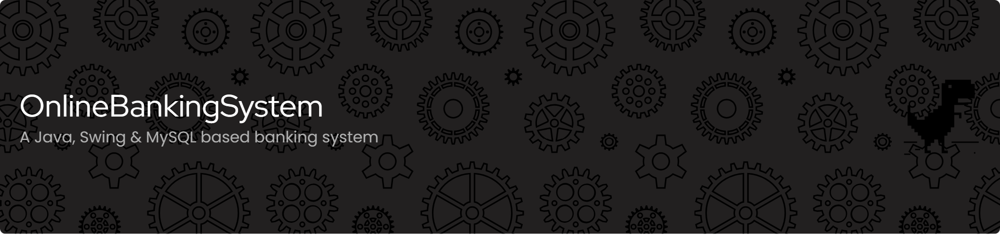
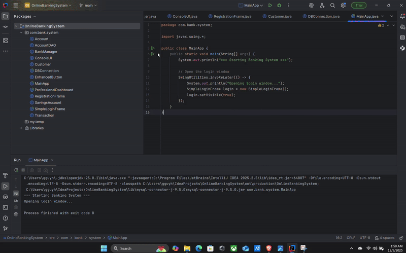
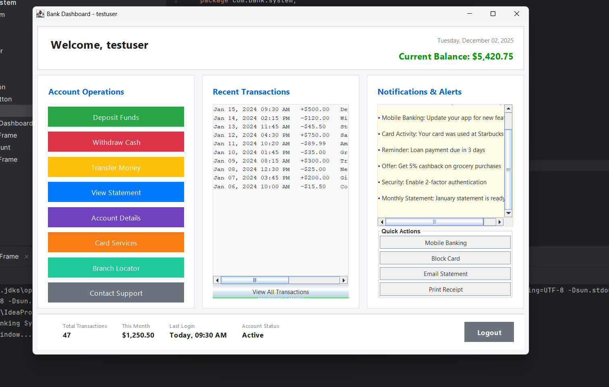
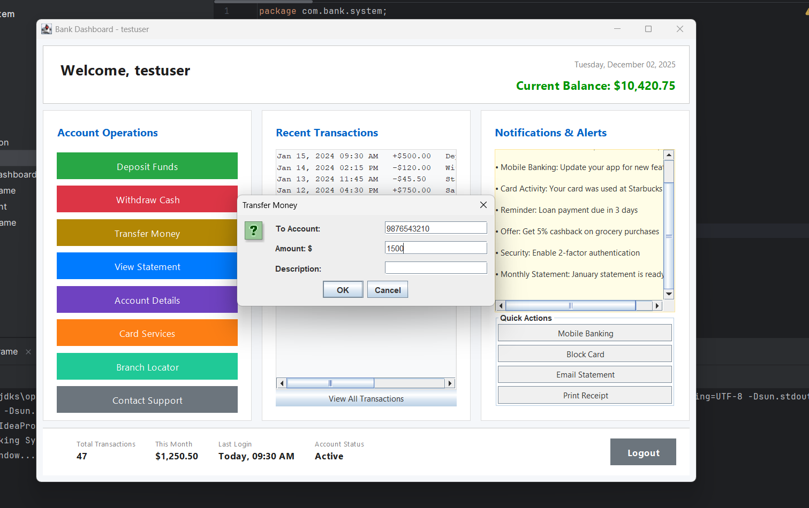

<!-- ===== START: Custom header block - paste ONLY this and remove previous header/banner blocks ===== -->

<!-- Top banner (full width) -->

  

<!-- Title (big, exactly below banner) -->
<h1 align="center" style="margin: 10px 0 6px 0; font-size:44px; line-height:1.05;">OnlineBankingSystem</h1>

<!-- BADGES: perfectly centered, single horizontal row -->

  <!-- TOP ROW -->
  
  
  
  

    

  <!-- BOTTOM ROW -->
  
  

  <!-- second row beneath the first, keeps the same centered alignment -->

<!-- Architecture image: centered in a fixed-width container so badges can align to its left exactly -->

  
  <!-- Database badge placed left-aligned relative to the image container -->
  

    <!-- tweak margin-left here if you want pixel-perfect nudging (default 6px) -->
    

      
    

  

<!-- ===== END: Custom header block ===== -->

## 📑 Table of Contents
- [App Demo (GIF Preview)](#app-demo-gif-preview)
- [Overview](#overview)
- [Tech Stack](#tech-stack)
- [Application Screenshots](#application-screenshots)
- [Features](#features)
- [Project Structure](#project-structure)
- [Database Setup](#database-setup)
- [How to Run](#how-to-run)
- [Release Notes](#release-notes)
- [Author](#author)
- [Connect With Me](#connect-with-me)

---

## 📱 App Demo (GIF Preview)

  

---

## 🌐 Overview

A Java-based **Online Banking System** built with Java Swing and JDBC.  
Includes login, dashboard, transactions, account management, PDF export and MySQL storage.

---

## 🛠 Tech Stack
- Java 17  
- Swing UI  
- MySQL  
- JDBC  
- PDF Export  

---

## 🖼 Application Screenshots

### 🔹 Login & Dashboard  

  
  

### 🔹 Deposit & Deposit Success  

  
  

### 🔹 Account Details & Transfer  

  
  

### 🔹 Account Statement  

  

---

## ⭐ Features
- Login system  
- Interactive dashboard  
- Deposit / Withdraw / Transfer  
- Transaction history  
- Account details viewer  
- PDF statement export  
- Notification panel  

---

## 📁 Project Structure
OnlineBankingSystem/
├── src/com/bank/system/ # Java source code
├── assets/ # Screenshots / GIF / Images
├── sql/bank_db.sql # Database schema
├── README.md # Documentation
└── .gitignore

---

## 🗄️ Database Setup
1. Open **MySQL Workbench / phpMyAdmin**  
2. Run SQL script: `sql/bank_db.sql`  
3. Update DB credentials: `src/com/bank/system/DBConnection.java`

---

## ▶️ How to Run
1. Install **JDK 11+**  
2. Open project in **IntelliJ IDEA**  
3. Add MySQL Connector/J to libraries  
4. Run `Main.java`

---

## 📝 Release Notes — v1.0 (Student Project)
**Completed**: Login, Dashboard, Deposit/Withdraw/Transfer, Transaction history, PDF export, MySQL connectivity.  
**Improvements**: cleaner UI, input validation fixes, smoother navigation.  
**Optional future**: Dark mode, animated UI, encrypted passwords.

---

## 👨‍💻 Author
**SUMIT KAUSHAL** — BTech CSE, 3rd Semester, Galgotias University

---

## 🤝 Connect With Me

  

Made by Sumit Kaushal

